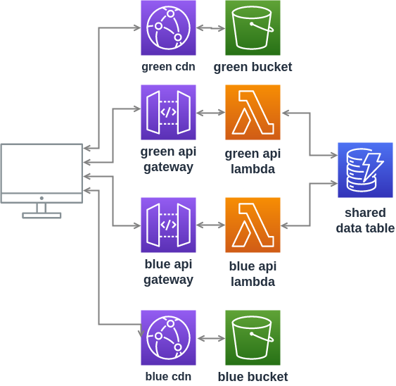

# guitar-app
Example app with AWS Cloudfront, S3, Lambda, CDK, API Gateway and Github actions based CI/CD

This repository contains code that is deployed by the [pipeline repository](https://github.com/chestercodes/guitar-app-pipeline). The project is built by github actions and adds the artifacts and manifest to the pipeline S3 bucket which triggers the deployment pipeline. The artifacts produced are:

- site - website that displays the guitars
- api - lambda function that is used for the backend
- tests - a couple of basic E2E tests to smoke test the deployment
- deploy - contains the deployment project which is passed the artifacts keys as environment variables and then run

The app is deployed to two Cloudfront distribution and S3 bucket pairs, in a Green/Blue deployment strategy.
More information about this can be seen in [this blog post](https://chester.codes/cloudfront-green-blue).
The data layer, in the form of a DynamoDB table is shared between the two environments which needs to be considered when deploying.

